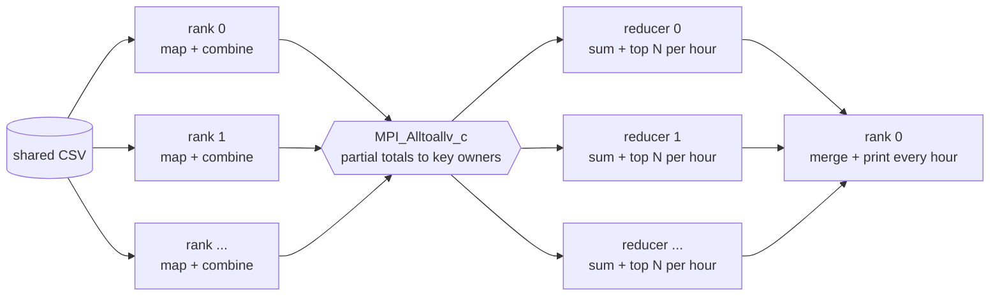

# m3t3d - Traffic control simulator with MPI MapReduce

Module 3, task 3.
The m2t3d question, which traffic lights were the most congested in each hour, answered by MPI processes that share one input file instead of threads that share one queue.



## Files

| File | What it does |
|---|---|
| `traffic_mr.cpp` | The MPI MapReduce program. Map, plan, shuffle, reduce, gather. |
| `traffic_common.h` | Line parser, date helpers, ranking order and the car-count model, copied from m2t3d so both tasks parse and rank identically. |
| `traffic_gen_skew.cpp` | Generates files whose keys are unevenly spread across hours, for testing the partition strategies. |
| `tiny.csv` | 24 rows, 4 lights over 2 hours. Small enough to check by hand. |
| `run_experiments.sh` | Runs every experiment and writes `results.csv`. Builds the m2t3d baseline from `../m2t3d`. |
| `results.csv` | One row per run. |

## Requirements

```
sudo apt install g++ coreutils openssl
```

MPI comes from the Anaconda install, which provides MPICH 4.3.2, the same setup as m3t1p and m3t2c.
The system OpenMPI and system MPICH both hang in `MPI_Init` on this WSL2 setup.
Anaconda's `mpic++` wrapper calls a conda compiler that is not installed, so `MPICH_CXX` has to point it at the system compiler.

## Build

```
export MPICH_CXX=g++
export MPI_BIN=~/anaconda3/bin

$MPI_BIN/mpic++ -std=c++17 -O2 -Wall -Wextra -o traffic_mr traffic_mr.cpp
g++ -std=c++17 -O2 -Wall -Wextra -o traffic_gen_skew traffic_gen_skew.cpp
```

The path is absolute on purpose.
A bare `mpic++` resolves by PATH, and a shell without Anaconda on PATH picks up the system OpenMPI wrapper, which produces a binary the MPICH launcher cannot run.

The m2t3d baseline, which `run_experiments.sh` also builds:

```
g++ -std=c++17 -O2 -pthread -Wall -o traffic_sim ../m2t3d/traffic_sim.cpp
```

## Run

```
$MPI_BIN/mpirun -np 3 ./traffic_mr --in tiny.csv --top 3 --print-hours 2 --trace
$MPI_BIN/mpirun -np 8 ./traffic_mr --in ../m2t3d/data/traffic_large.csv --partition weighted --verify
```

| Flag | Default | Meaning |
|---|---|---|
| `--in` | required | input file, same format as m2t3d |
| `--partition` | `weighted` | `block`, `hash`, `weighted`, `light` or `hybrid`, how keys are assigned to reducers |
| `--reducers` | process count | how many ranks reduce, from 1 up to the process count. Every rank maps. |
| `--top` | 5 | lights ranked per hour |
| `--print-hours` | 3 | hours printed to the console, 0 for none |
| `--out-summary` | none | write every hour's ranking to a file in the m2t3d format |
| `--no-combine` | off | ship every record instead of one partial total per key |
| `--verify` | off | gather every total to rank 0 and print the m2t3d checksum |
| `--trace` | off | print every line each rank mapped, every entry it sent and every sum it made. For small files. |
| `--matrix` | off | print the shuffle matrix, entries sent from each rank to each rank |
| `--csv` | off | emit the machine-readable line |

Unknown flags are an error, the same as m2t3d.
The input format is the m2t3d one, `YYYY-MM-DD HH:MM,TLxxxx,cars` with no header row, and rows may be in any order.

Rank 0 writes a banner and one line per phase to stderr, so a run is never a silent terminal.
Results go to stdout: the ranking, a per rank table, shuffle cost, balance and phase timings.

```
Top 3 congested lights per hour (first 2 hours shown):
  2026-08-01 08:00
     1. TL0003        120 cars
     2. TL0001         60 cars
     3. TL0002         15 cars
  2026-08-01 09:00
     1. TL0004         90 cars
     2. TL0001         50 cars
     3. TL0002         50 cars

rank  bytes         records     mapped    ->local   ->remote   received       keys     map ms  reduce ms
   0  [0, 213)            9          3          3          0          6          4        0.0        0.0
   1  [213, 426)          8          6          0          6          0          0        0.0        0.0
   2  [426, 639)          7          3          3          0          6          3        0.0        0.0

shuffle     12 entries, 0.00 MiB, 50.0% crossed to another rank
imbalance   entries received max/mean 1.500   reduce time max/mean 1.756
phases      map 0.28  plan 0.08  shuffle 0.02  reduce 0.00  gather 0.01  (ms)
total       0.39 ms
```

`total` is map, plan, shuffle, reduce and gather.
Printing, writing `--out-summary`, and `--verify`'s gather all sit outside it.
Each phase ends at a barrier, so rank 0's timestamps always include the slowest rank.

## Checking against m2t3d

`--out-summary` writes the same format as `traffic_sim --out-summary`, and `--verify` prints the same checksum as m2t3d, so the two tasks compare directly.

```
../m2t3d/traffic_sim seq --in tiny.csv --top 3 --out-summary m2.out
$MPI_BIN/mpirun -np 4 ./traffic_mr --in tiny.csv --top 3 --verify --out-summary mr.out
cmp m2.out mr.out
```

m2t3d needs rows in time order and sizes its arrays from the first and last line.
For a skewed file, pass it `--lights` with the value the generator prints.

## Datasets

The uniform workloads are the m2t3d files in `../m2t3d/data`, so their checksums match that task's results.
`run_experiments.sh` generates any that are missing with the m2t3d generator.

The skewed workloads go in `data/`, which is gitignored.

```
./traffic_gen_skew --out data/skew_small.csv    --lights 200  --hours 168
./traffic_gen_skew --out data/skew_rollout.csv  --lights 1500 --hours 3360 --incident-share 0
./traffic_gen_skew --out data/skew_incident.csv --lights 1500 --hours 3360 --incident-share 0.25
```

| Flag | Default | Meaning |
|---|---|---|
| `--lights` | required | lights installed at full rollout |
| `--hours` | required | hours in the file, starting 2026-08-01 00:00 |
| `--rollout` | 0.1 | share of lights installed in the first hour, rising linearly to all of them |
| `--incident-share` | 0.25 | share of every key in the file that falls in the incident hour, 0 for none |
| `--incident-hour` | hours / 2 | hour index of the incident |
| `--seed` | 42 | RNG seed |

The shuffled medium workload uses the seeded random source from the coreutils manual, so it comes out the same on every machine with the same `shuf` and `openssl`:

```
shuf --random-source=<(openssl enc -aes-256-ctr -pass pass:315 -nosalt < /dev/zero 2>/dev/null) \
    ../m2t3d/data/traffic_medium.csv > data/traffic_medium_shuffled.csv
```

## Benchmark

```
./run_experiments.sh
EXPERIMENTS="scaling" WORKLOADS="small medium" PROCS="1 4" REPEATS=1 ./run_experiments.sh
```

| Variable | Default |
|---|---|
| `EXPERIMENTS` | `scaling skew combiner reducers order` |
| `WORKLOADS` | `small medium large xlarge` |
| `PROCS` | `1 2 4 8 16` |
| `SKEW_PROCS` | `1 2 4 8 16` |
| `PARTITIONS` | `block hash weighted light hybrid` |
| `REDUCERS` | `1 2 4 8 16` |
| `REPEATS` | `3` |
| `OUT` | `results.csv` |
| `MPI_BIN` | `$HOME/anaconda3/bin` |

Each workload is read once before its timed runs, so the first run does not pay for a cold disk.

`results.csv` columns:

```
experiment,workload,rows,impl,procs,reducers,partition,combiner,keys,shuffle_entries,remote_entries,entry_imbalance,time_imbalance,map_ms,plan_ms,shuffle_ms,reduce_ms,gather_ms,total_ms,checksum,run,command
```

The last column holds the exact command that produced the row.
For the m2t3d rows, `procs` holds the producer count and `reducers` the consumer count, which is the role each plays, and only `total_ms` and `checksum` are filled.

## Stress test

A year of data, 5000 lights over 8760 hours, 525.6 million rows and 13.1 GiB, generated with the m2t3d generator:

```
./traffic_sim gen --out data/stress_year.csv --lights 5000 --hours 8760
```

Both runs cap every process at 1 GiB of address space, so 16 ranks share about the 15.5 GiB the machine has.
A rank that runs out prints which phase it was in, and the job aborts.

```
bash -c 'ulimit -v 1048576; ~/anaconda3/bin/mpirun -np 16 ./traffic_mr --in data/stress_year.csv --print-hours 1'
bash -c 'ulimit -v 1048576; ~/anaconda3/bin/mpirun -np 16 ./traffic_mr --in data/stress_year.csv --print-hours 1 --no-combine'
```

The first completes.
The second runs out of memory in the shuffle, because without the combiner every rank has to hold all of its raw records, then a second copy of them in the send buffer.

## If a run appears to hang

A working run prints its banner within a second.
An empty terminal means the ranks died before reaching `MPI_Init`, and the usual cause is a binary built by one MPI and launched by another's `mpirun`.

```
ldd ./traffic_mr | grep -oE 'libmpi[_a-z]*\.so\.[0-9]+'
```

`libmpi.so.12` is MPICH and is correct here.
`libmpi.so.40` is OpenMPI, which means the build used `/usr/bin/mpic++`; rebuild with the absolute path above.
