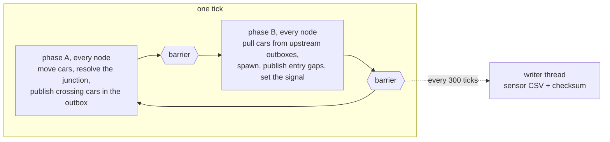

# m4t1d - citysim, a parallel city traffic simulator in Rust

Module 4, task 1.
Cars drive through a grid of actuated traffic lights under the Nagel-Schreckenberg rules, one simulated second per tick.
Each light's sensor writes car counts in the m2t3d and m3t3d CSV format, so `m3t3d/traffic_mr` can rank the congested lights of the simulated city.
Five backends advance the same city, and every one of them produces a bit-identical state.



## Files

| File | What it does |
|---|---|
| `src/main.rs`, `src/cli.rs` | The `citysim` binary: subcommands, flags, the run loop and the report. |
| `src/lib.rs` | The library the binary and the tests use. |
| `src/params.rs` | Model parameters, the demand model and the rush-hour table from m2t3d. |
| `src/philox.rs` | Philox-4x32-10 counter-based random numbers, with the Random123 known-answer vectors. |
| `src/grid.rs`, `src/car.rs` | Grid numbering, turns, the 16-byte car and the ring each link keeps its cars in. |
| `src/nasch.rs` | The Nagel-Schreckenberg update of one link. |
| `src/junction.rs`, `src/signal.rs` | Who crosses at an intersection, and the actuated signal. |
| `src/city.rs` | City state, the two per-node phases `step_a` and `step_b`, and snapshots. |
| `src/sched/mod.rs` | The `Engine` trait, the `seq` backend and the timing statistics. |
| `src/sched/partitioned.rs` | The `static` and `balanced` backends, the spin barrier and the cut functions. |
| `src/sched/rayon.rs` | The `rayon` work-stealing backend. |
| `src/gpu/mod.rs`, `src/gpu/kernels.cu` | The `cuda` backend. The kernels mirror the Rust functions and are compiled with NVRTC at start-up. |
| `src/checksum.rs`, `src/invariants.rs` | State and sensor checksums, and the invariants checked while running. |
| `src/sensors.rs`, `src/stats.rs` | Sensor CSV writer thread, window lines, summary and CSV line. |
| `src/compare.rs` | Runs two backends side by side and finds the first node where they differ. |
| `tests/determinism.rs` | Every CPU backend, thread count and partition against `seq`. |
| `tests/gpu.rs` | The `cuda` backend against `seq`. |
| `tests/barrier_loom.rs` | Model checks of the spin barrier with loom. |
| `setup_nvrtc.sh` | Installs NVRTC into `.venv` and writes `cuda_env.sh`. |
| `e2e_m3.sh` | Simulates a city and checks that m2t3d and m3t3d read its sensor file with matching checksums. |
| `run_experiments.sh` | Runs every experiment and writes `results.csv`. |
| `results.csv` | One row per run. |

## Requirements

Rust 1.85 or newer, since the crate uses edition 2024.

```
curl --proto '=https' --tlsv1.2 -sSf https://sh.rustup.rs | sh
```

The `cuda` backend also needs an NVIDIA driver with CUDA 13.3 or newer and NVRTC.
Under WSL2 the driver comes from Windows through `/usr/lib/wsl/lib`, and `setup_nvrtc.sh` installs NVRTC 13.3.33 from PyPI into `.venv`, so neither a CUDA toolkit nor sudo is needed.

```
./setup_nvrtc.sh
source ./cuda_env.sh
```

`cuda_env.sh` sets `LD_LIBRARY_PATH` and has to be sourced in every new shell before a GPU run.

`e2e_m3.sh` needs g++ and the Anaconda MPICH that m3t3d uses.

## Build

```
cargo build --release
cargo build --release --features cuda
```

The binary is `target/release/citysim`.

## Run

```
./target/release/citysim run --city 64x64 --start 07:00 --duration 2h
./target/release/citysim run --city 128x128 --backend balanced --threads 16 --sensors data/m.csv
./target/release/citysim run --city 512x512 --backend cuda --duration 30m
```

City flags, shared by `run` and `compare`:

| Flag | Default | Meaning |
|---|---|---|
| `--city` | required | grid of intersections, rows x columns |
| `--link-cells` | 32 | cells per approach link, 7.5 m each |
| `--seed` | 42 | random seed |
| `--brake` | 0.25 | random braking probability |
| `--turns` | 70,15,15 | turn split in percent: straight, left, right |
| `--trip-end` | 0.05 | probability a car parks on each link it enters |
| `--min-green`, `--max-green` | 10, 45 | signal green times in seconds |
| `--detector` | 8 | detector length in cells before the stop line |
| `--peak`, `--floor`, `--edge` | 0.02, 0.001, 0.01 | spawn probability per link per second downtown, far from downtown, and extra on links entering from the edge |
| `--spread` | a sixth of the city | radius of the downtown peak in intersections |
| `--demand` | 1.0 | multiplier on all demand |
| `--event` | none | `ROW,COL,HH:MM,MINUTES[,PEAK]`, extra demand around one intersection |

Backend and time flags:

| Flag | Default | Meaning |
|---|---|---|
| `--backend` | `seq` | `seq`, `static`, `rayon`, `balanced` or `cuda` |
| `--threads` | every logical CPU | workers for `static`, `rayon` and `balanced` |
| `--block` | 64 | nodes per scheduling block; for `cuda`, threads per CUDA block |
| `--cost` | `cars` | what `balanced` cuts by: car counts, or the measured `time` of each block |
| `--rebalance-every` | 1 | windows between `balanced` repartitions, 0 to keep the first |
| `--start` | 06:00 | start time of an empty city |
| `--duration` | 1h | simulated time, a multiple of 5 minutes |
| `--load-state` | none | start from a snapshot instead |
| `--save-state` | none | write a snapshot of the final state |

Output flags of `run`:

| Flag | Default | Meaning |
|---|---|---|
| `--sensors` | none | write the sensor CSV |
| `--pipeline` | `on` | `off` makes the run wait for the writer thread after each window |
| `--window-log` | none | also write the per-window lines to a file |
| `--check` | off | check every invariant after every tick |
| `--csv` | off | print the machine-readable line |

A run prints one line per 5-minute window to stderr: time, cars on the road, share stopped, crossings, wall time, per-phase and per-window load imbalance on more than one thread, and the state checksum.
The summary on stdout gives car totals, timings, balance statistics and two checksums.
The state checksum covers every car and every intersection.
The sensor checksum is the one m2t3d and m3t3d print for the same data.

The sensor CSV has one row per light per window and no header, `YYYY-MM-DD HH:MM,TLxxxx,cars`, starting 2026-08-01.
Light `TLn` is intersection `n`, numbered row by row.

## Other commands

```
./target/release/citysim compare --city 37x29 --a seq --b balanced --threads 7 --duration 30m
./target/release/citysim info --city 1024x1024
./target/release/citysim selftest
```

`compare` runs two backends from the same start and compares their state checksums every `--every` ticks, 1 by default.
It stops at the first difference and prints both versions of the first intersection that differs.

`info` prints a city's size and memory needs against the memory available.

`selftest` checks Philox against the Random123 vectors.
Built with `--features cuda`, it also compiles the kernels, runs the same check on the GPU, compares a million GPU and CPU draws and times a kernel launch.

## Tests

```
cargo test --release
source ./cuda_env.sh && cargo test --release --features cuda
RUSTFLAGS="--cfg loom" CARGO_TARGET_DIR=target/loom cargo test --release --test barrier_loom
cargo +nightly miri test --lib -- philox nasch junction checksum car signal grid two_workers barrier_releases
```

The Miri line needs a nightly toolchain with the `miri` component.

## Checking against m2t3d and m3t3d

```
./e2e_m3.sh
CITY=64x64 DURATION=6h PROCS=8 ./e2e_m3.sh
```

The script builds citysim with `--features cuda`, or without it when `CUDA=0`, builds `traffic_sim` and `traffic_mr` from `../m2t3d` and `../m3t3d` into `data/`, simulates the city, and runs both on its sensor file.
It passes when all three programs print the same checksum and the two analysers write identical rankings.

## Benchmark

```
source ./cuda_env.sh && ./run_experiments.sh
EXPERIMENTS="scaling" SIZES="M" REPEATS=1 ./run_experiments.sh
CUDA=0 EXPERIMENTS="scaling balance" ./run_experiments.sh
```

| Variable | Default |
|---|---|
| `EXPERIMENTS` | `scaling balance gpu stress` |
| `SIZES` | `S M L XL`, which are 32x32, 128x128, 512x512 and 1024x1024 |
| `REPEATS` | 5 |
| `BIG_REPEATS` | 3, used for L, XL and the balance runs |
| `BALANCE_THREADS` | `8 16 24 32` |
| `BLOCKS` | `32 64 128 256 512`, the CUDA block sizes tried on L |
| `OUT` | `results.csv` |
| `DATA` | `data` |
| `CUDA` | 1, or 0 to build without the GPU and skip the GPU runs |

The script copies the binary to `data/citysim-bench` before it starts, and writes warm snapshots at 07:00 and 07:30 into `data/` the first time it needs them.

`results.csv` columns:

```
experiment,scenario,run,backend,threads,block,cost,rebalance,city,link_cells,ticks,spawned,exited,parked,active,wall_ms,ms_per_tick,real_time_ratio,phase_a_ms,phase_b_ms,sync_ms,imbalance,window_imbalance,migration,repartitions,compile_ms,write_ms,state,sensor,exit,max_rss_kb,command
```

The last column holds the exact command that produced the row.

## Stress test

A 2896x2896 city has 8.4 million intersections and needs 16.9 GiB of car slots and metadata.

```
bash -c 'ulimit -v 12582912; ./target/release/citysim run --city 2896x2896 --start 07:30 --duration 10m --backend static --threads 16'
./target/release/citysim run --city 2896x2896 --start 07:30 --duration 10m --backend cuda
./target/release/citysim run --city 4096x4096 --start 07:30 --duration 5m --backend cuda
```

The first run stops before simulating, names the array it could not allocate and exits with code 2.
The second keeps the whole city in GPU memory and runs.
The third needs more GPU memory than the card has, fails the check before allocating and exits with code 2.
`ulimit -v` also limits the address space the CUDA driver maps GPU memory into, so the GPU run has to go without it.
